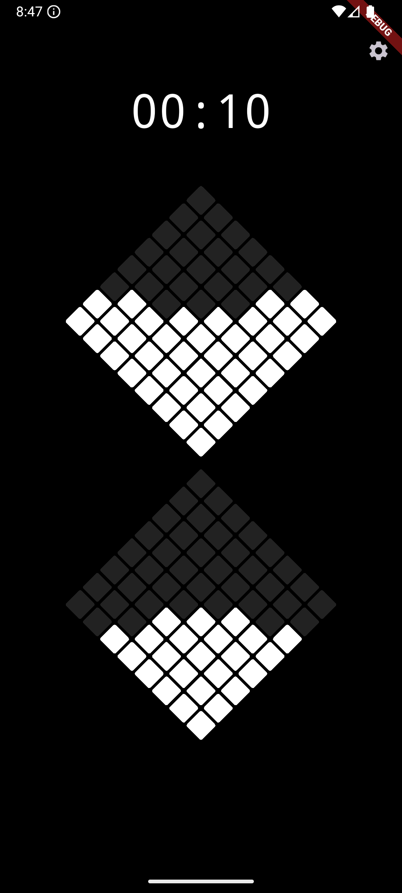

# Pixel Hourglass

A minimalist, pixel-art hourglass application built with Flutter that responds to your device's orientation.


-----

## ✨ Features

  * **Pixel Art Design:** A retro, grid-based visual for the sand timer.
  * **Sensor-Driven:** The hourglass flips and sand flows based on your device's physical orientation (upright, upside down, or tilted).
  * **Customizable Timer:** Tap the digital clock to set any duration you need.
  * **State Persistence:** Remembers your last-used timer duration (using `provider` and `shared_preferences`).
  * **Settings Page:** A dedicated screen to toggle preferences like sound and haptic feedback.

-----

## 🚀 How to Use

1.  **Set Time:** Tap the time display (e.g., `00:15`) to open a time picker and set your desired duration.
2.  **Start Timer:** Tilt your device upright or upside down to begin the sand flow.
3.  **Pause Timer:** Tilt your device on its side (horizontally) to pause the flow.
4.  **Reset/Flip:** When the sand runs out, just flip your device over to start the timer again\!

-----

## 🛠️ Tech Stack

  * **Framework:** Flutter
  * **Language:** Dart
  * **State Management:** [Provider](https://pub.dev/packages/provider)
  * **Device Sensors:** Using a custom `SensorService` (likely wrapping a package like `sensors_plus`) to detect orientation changes.
  * **Storage:** [shared\_preferences](https://pub.dev/packages/shared_preferences) for saving settings.

-----

## 🏃‍♂️ Running Locally

To run this project on your local machine:

1.  **Ensure you have the [Flutter SDK](https://flutter.dev/docs/get-started/install) installed.**

2.  **Clone this repository:**

    ```bash
    git clone https://github.com/the-Sreejith/ourglass.git
    cd pixel-hourglass
    ```

3.  **Install dependencies:**
WWW
    ```bash
    flutter pub get
    ```

4.  **Run the app:**

    ```bash
    flutter run
    ```